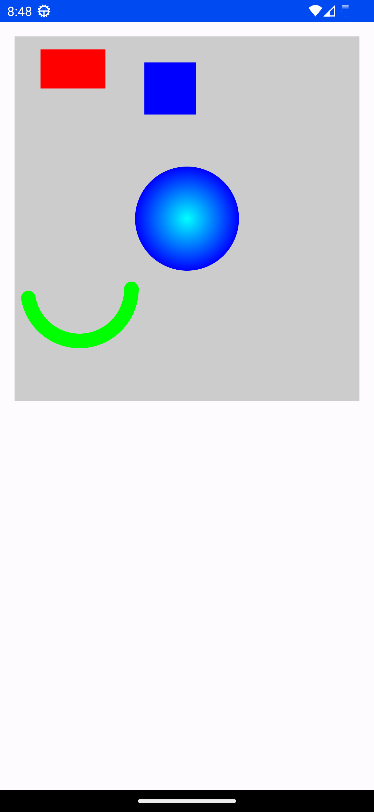
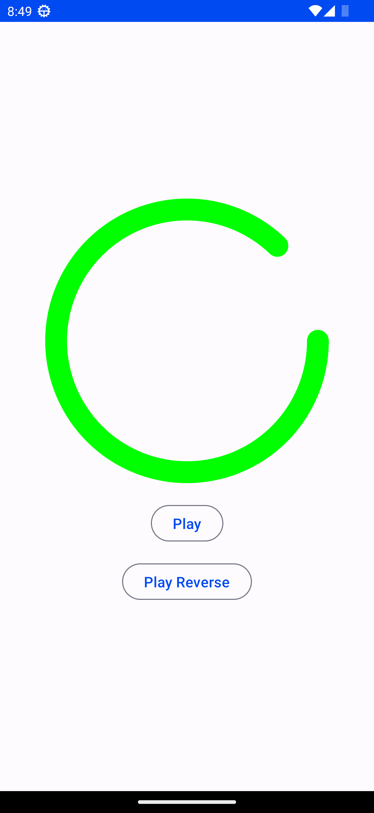
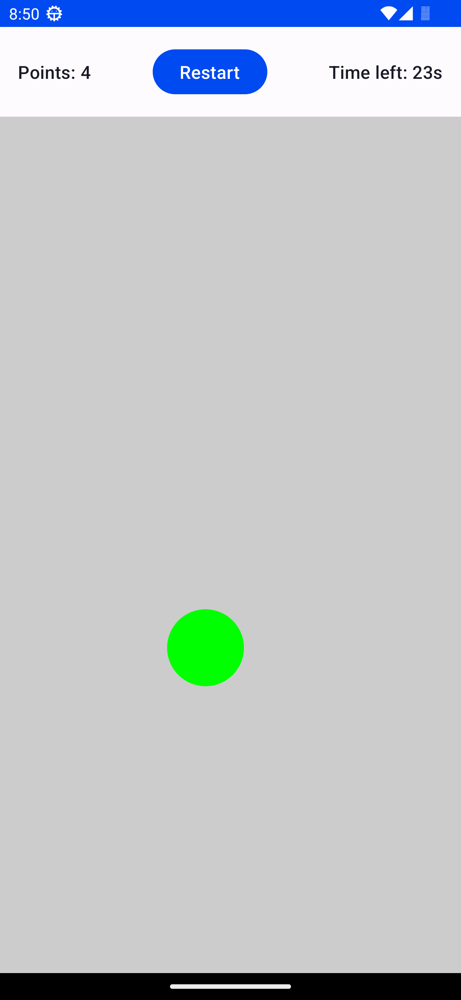
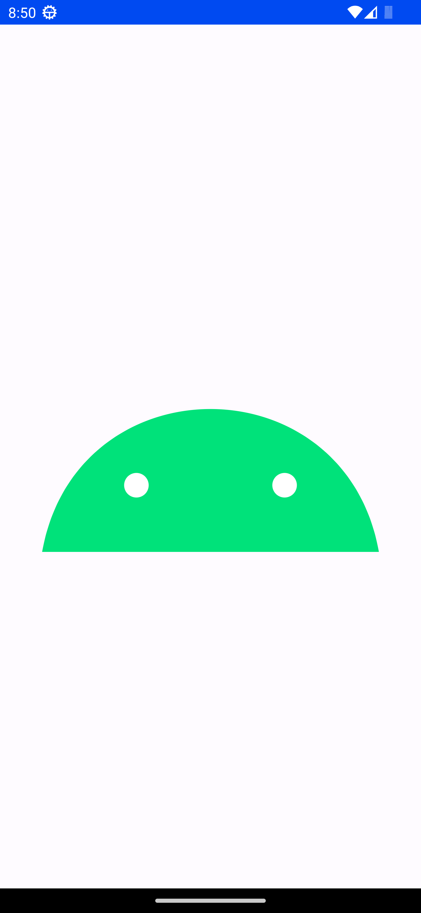
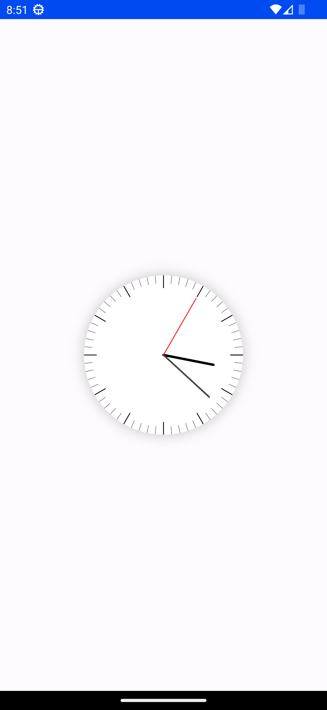
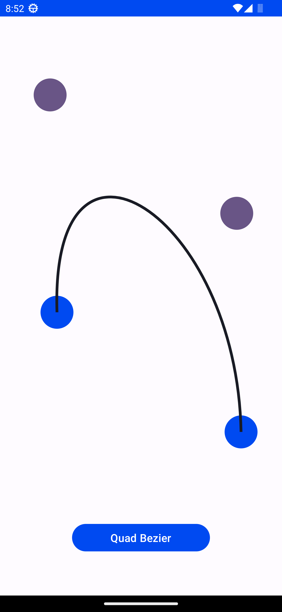
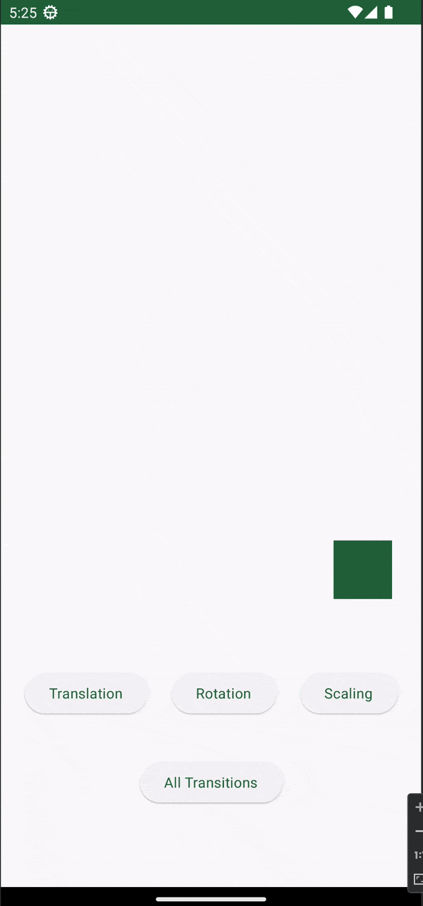
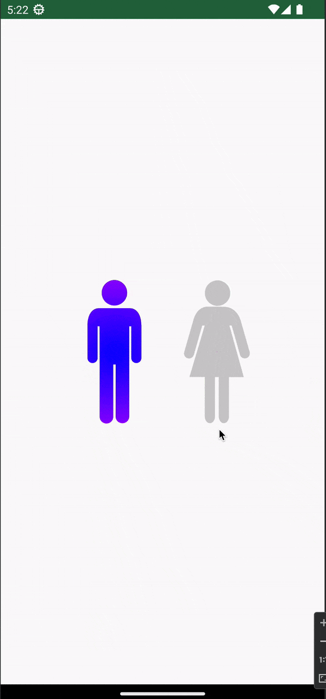
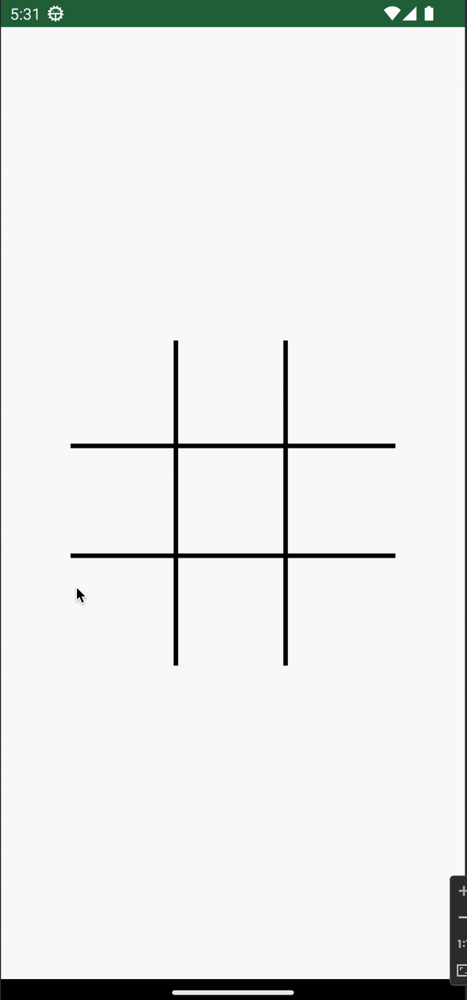

# Jetpack Compose Canvas Samples

Made this project in order to learn Custom Ui using Canvas API in Jetpack Compose

This project consists few screens (more to be added in future) for learning different parts of the Canvas API.

## Screens 📱

### **Overview** 🔎:
- **Shapes** - Screen to show different shapes
- **Circular Progress** - Screen with a Circular Progress bar which animates normally and in reverse order
- **Ball Clicker** - A ball clicker game screen
- **Clock** - A screen which displays a running analog clock
- **Android Logo** - Screen which just displays the Android Logo
- **Path** - Screen with few points and path between them, paths have bezier curves too.
- **Transformations** - Screen with shows canvas transformations
- **Gender Picker** - A Screen which lets user select one gender with a cool gradient fill animation
- **Tic Tac Toe** - A simple Tic-Tac-Toe game.

### **Learnings from each screen** 📚:
- **Shapes** - Drawing shapes
- **Circular Progress** - Animation of shapes.
- **Ball Clicker** - Detecting touch input on shapes.
- **Android Logo** - Drawing Paths with curves
- **Path** - Drawing paths with quad and cubic bezier curves
- **Transformations** - Using Canvas Transformations like translate, rotate and scale
- **Gender Picker** - Drawing custom vector paths using Canvas Transformations and handling click events in Transformed Canvas
- **Tic Tac Toe** - Path animations for multiple paths.

### **Screenshots** 📸

|                                               |                                                          |                                              |
|-----------------------------------------------|----------------------------------------------------------|----------------------------------------------|
|             |  |  |
|   |                          |                |
|  |                 |            |
